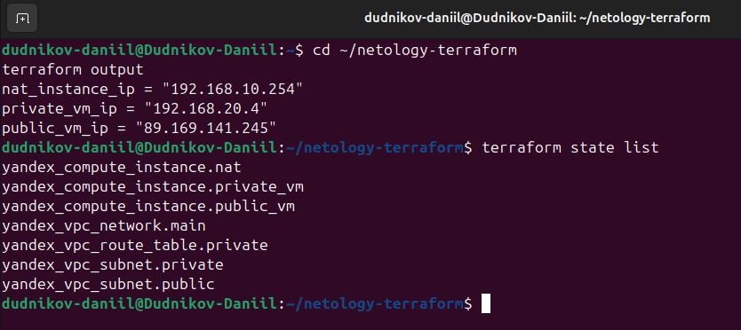
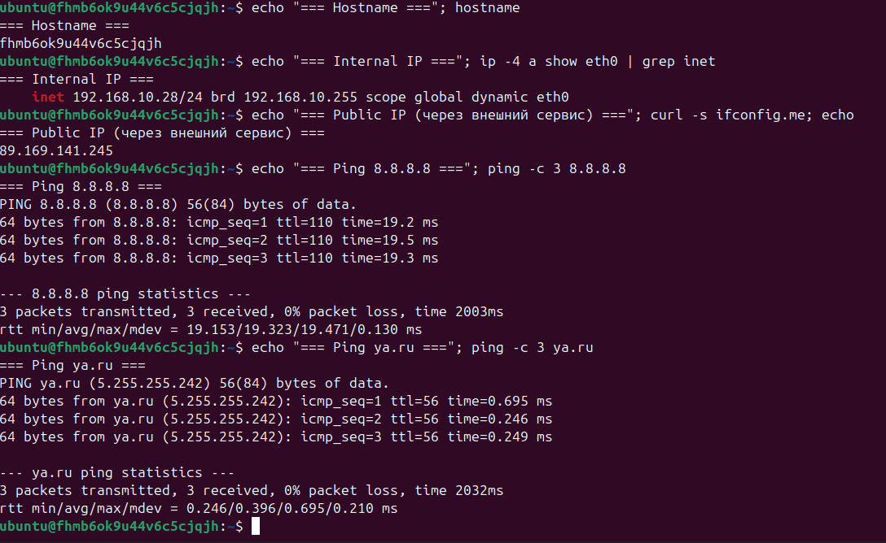
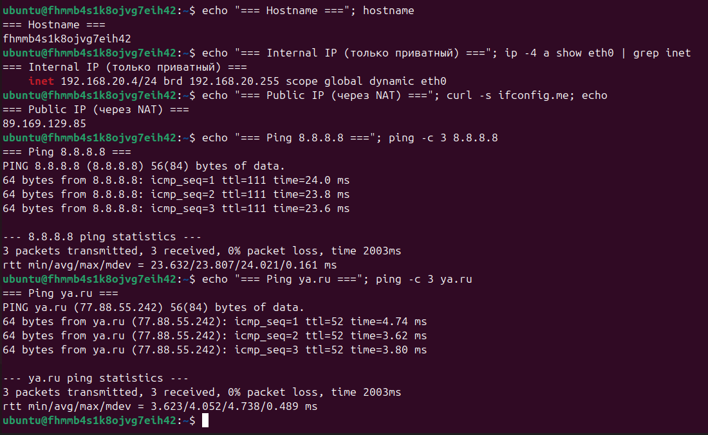
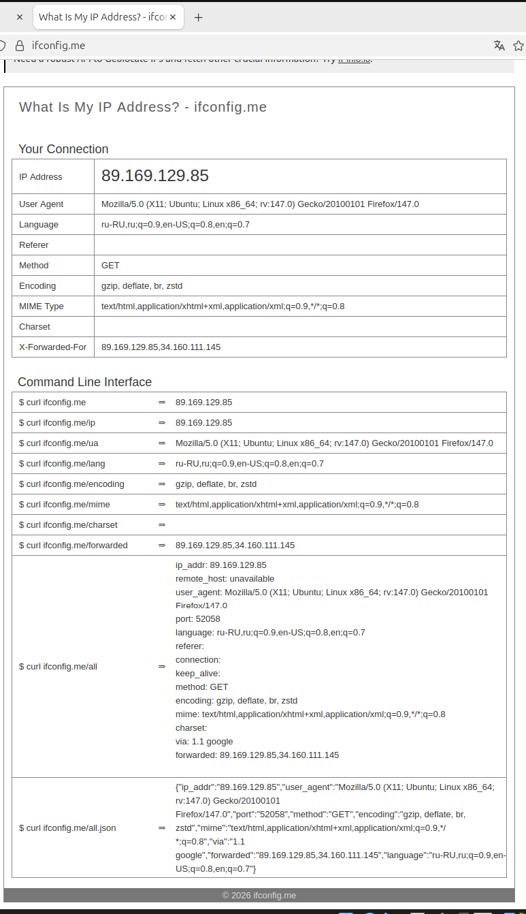
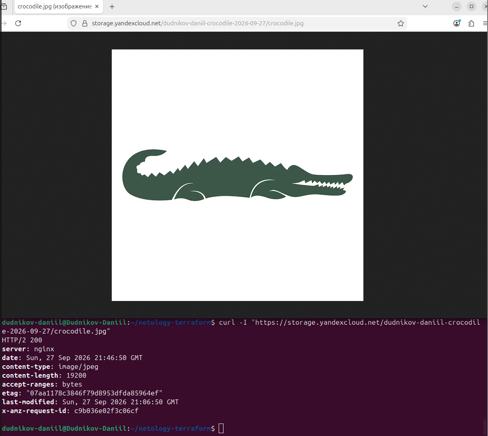
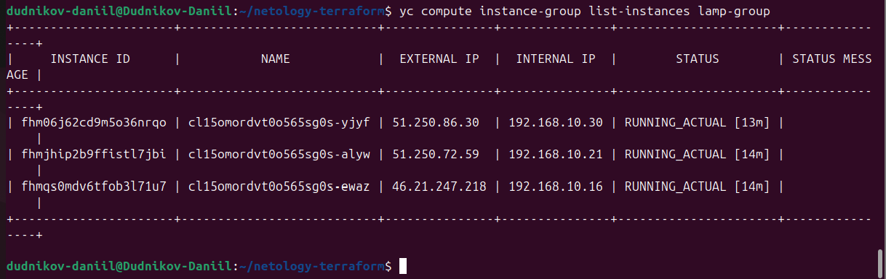
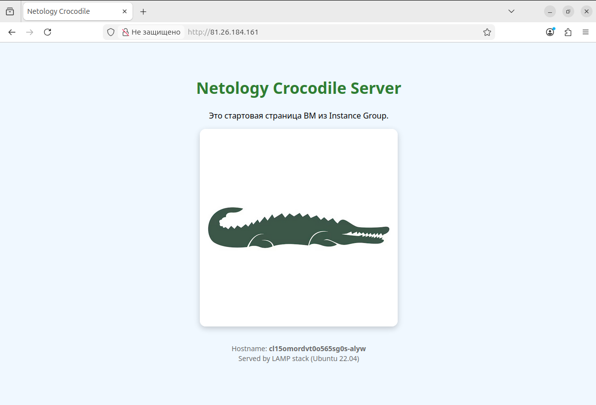
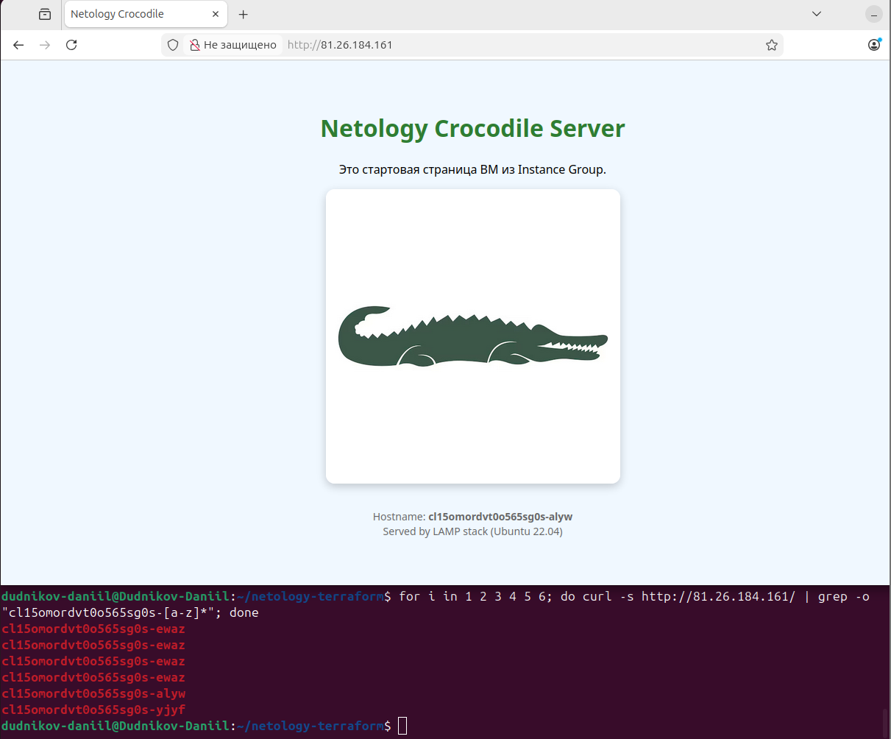
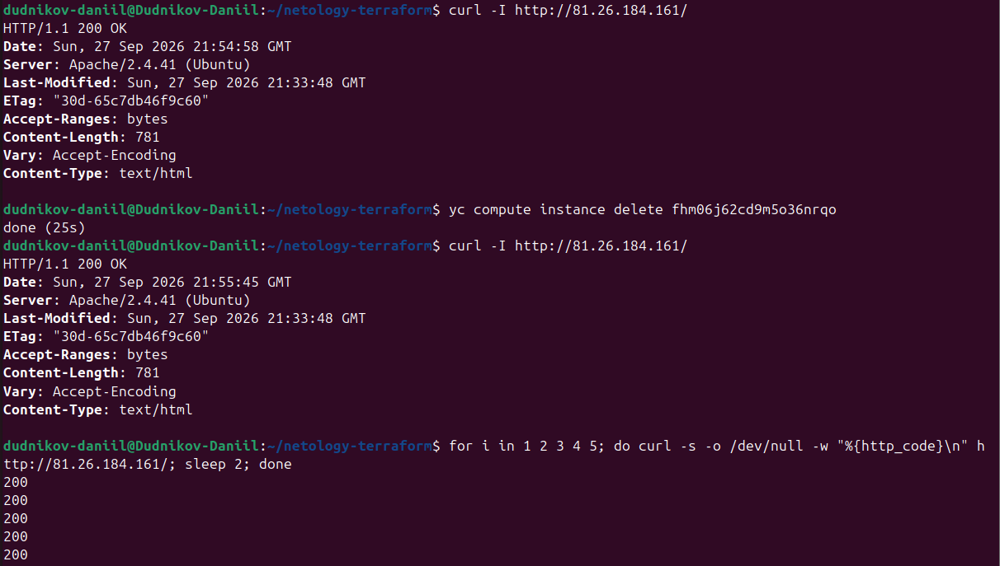
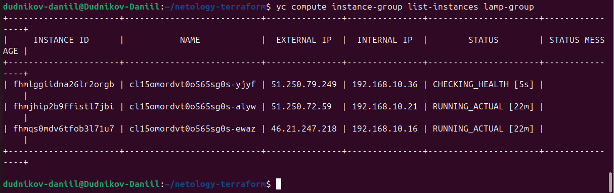

# Домашнее задание к занятию «Организация сети»

**Выполнил:** Дудников Даниил

## Оглавление

1. [Домашнее задание «Организация сети»](#домашнее-задание-организация-сети)
2. [Домашнее задание «Вычислительные мощности. Балансировщики нагрузки»](#домашнее-задание-вычислительные-мощности-балансировщики-нагрузки)

---
## Задание 1. Yandex Cloud

### Что сделано

- Создана VPC `netology-vpc` в зоне `ru-central1-a`.
- Публичная подсеть `public` — `192.168.10.0/24`.
- Приватная подсеть `private` — `192.168.20.0/24`.
- NAT-инстанс с внутренним IP `192.168.10.254` (образ `fd80mrhj8fl2oe87o4e1`).
- Route table для приватной подсети: статический маршрут `0.0.0.0/0` → `192.168.10.254`.
- Публичная ВМ `public-vm` с публичным IP — доступ в интернет напрямую.
- Приватная ВМ `private-vm` без публичного IP — доступ в интернет через NAT-инстанс.
- Подключение к приватной ВМ — через публичную (SSH Agent Forwarding / ProxyJump).

### Схема сети

```
                        Internet
                            ▲
                            │
        ┌───────────────────┴──────────────────────┐
        │            VPC netology-vpc              │
        │            зона ru-central1-a            │
        ├──────────────────────────────────────────┤
        │  public 192.168.10.0/24                  │
        │    ├─ NAT-инстанс 192.168.10.254 ────────┼──► Internet
        │    └─ public-vm (публичный IP)           │
        ├──────────────────────────────────────────┤
        │  private 192.168.20.0/24                 │
        │    └─ private-vm (только внутренний IP)  │
        │       route 0.0.0.0/0 → 192.168.10.254   │
        └──────────────────────────────────────────┘
```

---

## Структура репозитория

| Файл | Назначение |
|------|-----------|
| `providers.tf` | Провайдер Yandex Cloud |
| `variables.tf` | Переменные (зона, CIDR, образы, SSH-ключ) |
| `network.tf` | VPC, публичная и приватная подсети, route table |
| `nat-instance.tf` | NAT-инстанс |
| `compute.tf` | Публичная и приватная ВМ |
| `outputs.tf` | Выходные значения (IP-адреса) |
| `terraform.tfvars` | Значения переменных (SSH-ключ) — *в .gitignore* |
| `key.json` | Ключ сервисного аккаунта — *в .gitignore* |

---

## Тексты манифестов

### providers.tf

```hcl
terraform {
  required_providers {
    yandex = {
      source  = "yandex-cloud/yandex"
      version = "~> 0.140"
    }
  }
  required_version = ">= 1.5"
}

provider "yandex" {
  service_account_key_file = "key.json"
  cloud_id                 = "b1g39i7hv0f9r41b8vpv"
  folder_id                = "b1g6a8ilj1m6pl5so99m"
  zone                     = "ru-central1-a"
}
```

### variables.tf

```hcl
variable "zone" {
  description = "Зона доступности"
  type        = string
  default     = "ru-central1-a"
}

variable "folder_id" {
  description = "ID каталога"
  type        = string
  default     = "b1g6a8ilj1m6pl5so99m"
}

variable "cloud_id" {
  description = "ID облака"
  type        = string
  default     = "b1g39i7hv0f9r41b8vpv"
}

variable "ssh_public_key" {
  description = "Публичный SSH-ключ"
  type        = string
}

variable "nat_image_id" {
  description = "Образ для NAT-инстанса"
  type        = string
  default     = "fd80mrhj8fl2oe87o4e1"
}

variable "ubuntu_image_id" {
  description = "Образ Ubuntu 22.04 LTS"
  type        = string
  default     = "fd8vmcue7aajpmeo39kk"
}

variable "public_subnet_cidr" {
  type    = string
  default = "192.168.10.0/24"
}

variable "private_subnet_cidr" {
  type    = string
  default = "192.168.20.0/24"
}
```

### network.tf

```hcl
# VPC
resource "yandex_vpc_network" "main" {
  name = "netology-vpc"
}

# Публичная подсеть
resource "yandex_vpc_subnet" "public" {
  name           = "public"
  zone           = var.zone
  network_id     = yandex_vpc_network.main.id
  v4_cidr_blocks = [var.public_subnet_cidr]
}

# Приватная подсеть
resource "yandex_vpc_subnet" "private" {
  name           = "private"
  zone           = var.zone
  network_id     = yandex_vpc_network.main.id
  v4_cidr_blocks = [var.private_subnet_cidr]

  route_table_id = yandex_vpc_route_table.private.id
}

# Route table для приватной подсети
resource "yandex_vpc_route_table" "private" {
  name       = "private-route"
  network_id = yandex_vpc_network.main.id

  static_route {
    destination_prefix = "0.0.0.0/0"
    next_hop_address   = "192.168.10.254"
  }
}
```

### nat-instance.tf

```hcl
resource "yandex_compute_instance" "nat" {
  name        = "nat-instance"
  platform_id = "standard-v3"
  zone        = var.zone

  resources {
    cores  = 2
    memory = 2
  }

  boot_disk {
    initialize_params {
      image_id = var.nat_image_id
      size     = 10
    }
  }

  network_interface {
    subnet_id  = yandex_vpc_subnet.public.id
    ip_address = "192.168.10.254"
    nat        = true
  }

  metadata = {
    ssh-keys = "ubuntu:${var.ssh_public_key}"
  }
}
```

### compute.tf

```hcl
resource "yandex_compute_instance" "public_vm" {
  name        = "public-vm"
  platform_id = "standard-v3"
  zone        = var.zone

  resources {
    cores  = 2
    memory = 2
  }

  boot_disk {
    initialize_params {
      image_id = var.ubuntu_image_id
      size     = 10
    }
  }

  network_interface {
    subnet_id = yandex_vpc_subnet.public.id
    nat       = true
  }

  metadata = {
    ssh-keys = "ubuntu:${var.ssh_public_key}"
  }
}

resource "yandex_compute_instance" "private_vm" {
  name        = "private-vm"
  platform_id = "standard-v3"
  zone        = var.zone

  resources {
    cores  = 2
    memory = 2
  }

  boot_disk {
    initialize_params {
      image_id = var.ubuntu_image_id
      size     = 10
    }
  }

  network_interface {
    subnet_id = yandex_vpc_subnet.private.id
    nat       = false
  }

  metadata = {
    ssh-keys = "ubuntu:${var.ssh_public_key}"
  }
}
```

### outputs.tf

```hcl
output "public_vm_ip" {
  value       = yandex_compute_instance.public_vm.network_interface[0].nat_ip_address
  description = "Публичный IP публичной ВМ"
}

output "private_vm_ip" {
  value       = yandex_compute_instance.private_vm.network_interface[0].ip_address
  description = "Внутренний IP приватной ВМ"
}

output "nat_instance_ip" {
  value       = yandex_compute_instance.nat.network_interface[0].ip_address
  description = "Внутренний IP NAT-инстанса"
}
```

---

## Результаты

### 1. Успешное создание инфраструктуры

Вывод `terraform output` и `terraform state list` — видно, что созданы все 7 ресурсов (VPC, 2 подсети, route table, NAT-инстанс, 2 ВМ).



### 2. Доступ в интернет с публичной ВМ

Публичная ВМ `public-vm` (`fhmb6ok9u44v6c5cjqjh`) имеет внутренний IP `192.168.10.28` и публичный `89.169.141.245`. Пинги до `8.8.8.8` и `ya.ru` проходят без потерь, DNS работает.



### 3. Доступ в интернет с приватной ВМ через NAT-инстанс

Приватная ВМ `private-vm` (`fhmmb4s1k8ojvg7eih42`) имеет только внутренний IP `192.168.20.4`. Публичного IP у неё **нет**. Однако `curl ifconfig.me` возвращает `89.169.129.85` — это публичный IP **NAT-инстанса**. Значит, исходящий трафик приватной подсети идёт через NAT согласно route table.



### 4. Браузер на приватной ВМ через SSH-туннель

Firefox запущен локально, но его трафик завёрнут в SSH-туннель `локальная машина → public-vm → private-vm → NAT-инстанс → internet` (через SOCKS5-прокси на порту 1080). Сайт `ifconfig.me` видит IP `89.169.129.85` (NAT-инстанс), User-Agent — Ubuntu Firefox.



---

## Как воспроизвести

1. Установить Terraform и YC CLI, авторизоваться в Yandex Cloud.
2. Создать сервисный аккаунт и положить ключ в `key.json`.
3. Указать публичный SSH-ключ в `terraform.tfvars`:
   ```hcl
   ssh_public_key = "ssh-ed25519 AAAA..."
   ```
4. Выполнить:
   ```bash
   terraform init
   terraform apply
   ```
5. Проверить доступ:
   ```bash
   # публичная ВМ
   ssh -A -i ~/.ssh/id_ed25519 ubuntu@<public_vm_ip>

   # с публичной — на приватную
   ssh ubuntu@<private_vm_ip>
   ```

---


# Домашнее задание «Вычислительные мощности. Балансировщики нагрузки»

## Задание 1. Yandex Cloud

### Что сделано

- Создан **бакет Object Storage** `dudnikov-daniil-crocodile-2026-09-27` с картинкой.
- Картинка доступна из интернета по прямой ссылке.
- Создана **Instance Group** из 3 ВМ с LAMP (Ubuntu 22.04 + Apache).
- Через `user-data` (cloud-init) на каждой ВМ ставится LAMP и создаётся стартовая страница со ссылкой на крокодила.
- Настроен **health check** (HTTP, порт 80, `/`).
- Создан **Network Load Balancer** `lamp-nlb`, подключённый к target group Instance Group.
- Проверена **отказоустойчивость**: удалили одну ВМ — сайт продолжил работать, группа восстановила состав.

### Структура репозитория (часть 2)

| Файл | Назначение |
|------|-----------|
| `storage.tf` | Бакет Object Storage + картинка + публичный доступ |
| `cloud-init.yaml` | Cloud-init для ВМ: LAMP + index.html |
| `instance-group.tf` | Instance Group из 3 ВМ с LAMP и health check |
| `nlb.tf` | Network Load Balancer на 80 порт |
| `outputs.tf` | Дополнен: `bucket_name`, `crocodile_url`, `nlb_ip` |
| `variables.tf` | Дополнен: `bucket_name`, `yc_access_key`, `yc_secret_key`, `lamp_image_id` |

### Тексты манифестов

#### storage.tf

```hcl
resource "yandex_storage_bucket" "crocodile" {
  bucket        = var.bucket_name
  force_destroy = true
}

resource "yandex_storage_bucket_grant" "crocodile_grant" {
  bucket = yandex_storage_bucket.crocodile.bucket

  grant {
    type        = "Group"
    permissions = ["READ"]
    uri         = "http://acs.amazonaws.com/groups/global/AllUsers"
  }
}

resource "yandex_storage_object" "crocodile_image" {
  bucket       = yandex_storage_bucket.crocodile.bucket
  key          = "crocodile.jpg"
  source       = "crocodile.jpg"
  acl          = "public-read"
  content_type = "image/jpeg"

  depends_on = [yandex_storage_bucket_grant.crocodile_grant]
}
```

#### cloud-init.yaml

```yaml
#cloud-config
package_update: true
packages:
  - apache2
  - php
  - libapache2-mod-php

runcmd:
  - systemctl enable apache2
  - systemctl start apache2
  - |
    cat > /var/www/html/index.html <<'EOF'
    <!DOCTYPE html>
    <html lang="ru">
    <head><meta charset="UTF-8"><title>Netology Crocodile</title></head>
    <body>
      <h1> Netology Crocodile Server</h1>
      
    </body>
    </html>
    EOF
```

#### instance-group.tf

```hcl
resource "yandex_compute_instance_group" "lamp_group" {
  name               = "lamp-group"
  folder_id          = var.folder_id
  service_account_id = "aje8h986adoqhodic3ph"

  instance_template {
    platform_id = "standard-v3"

    resources {
      cores  = 2
      memory = 2
    }

    boot_disk {
      initialize_params {
        image_id = var.lamp_image_id
        size     = 10
      }
    }

    network_interface {
      network_id = yandex_vpc_network.main.id
      subnet_ids = [yandex_vpc_subnet.public.id]
      nat        = true
    }

    metadata = {
      ssh-keys  = "ubuntu:${var.ssh_public_key}"
      user-data = file("cloud-init.yaml")
    }
  }

  scale_policy {
    fixed_scale {
      size = 3
    }
  }

  allocation_policy {
    zones = [var.zone]
  }

  deploy_policy {
    max_unavailable = 1
    max_expansion   = 2
  }

  health_check {
    interval            = 10
    timeout             = 5
    healthy_threshold   = 2
    unhealthy_threshold = 3
    http_options {
      port = 80
      path = "/"
    }
  }

  load_balancer {
    target_group_name = "lamp-target-group"
  }
}
```

#### nlb.tf

```hcl
resource "yandex_lb_network_load_balancer" "lamp_nlb" {
  name = "lamp-nlb"

  listener {
    name = "http-listener"
    port = 80

    external_address_spec {
      ip_version = "ipv4"
    }
  }

  attached_target_group {
    target_group_id = yandex_compute_instance_group.lamp_group.load_balancer[0].target_group_id

    healthcheck {
      name = "http-healthcheck"
      http_options {
        port = 80
        path = "/"
      }
      interval = 10
      timeout  = 5
    }
  }
}
```

### Результаты

#### 1. Бакет Object Storage с картинкой

`https://storage.yandexcloud.net/dudnikov-daniil-crocodile-2026-09-27/crocodile.jpg`



#### 2. Instance Group из 3 ВМ с LAMP

Три ВМ в статусе `RUNNING_ACTUAL`, target group и health check настроены.



#### 3. Сайт через Network Load Balancer

`http://81.26.184.161/` — страница с крокодилом и hostname одной из ВМ.



#### 4. Балансировка между тремя ВМ

При многократных запросах hostname меняется: `...-yjyf`, `...-alyw`, `...-ewaz`.



#### 5. Проверка отказоустойчивости

Одна ВМ удалена вручную. Сайт продолжил отвечать `HTTP 200`.



#### 6. Восстановление Instance Group

Через ~1 минуту группа создала новую ВМ вместо удалённой.



---
